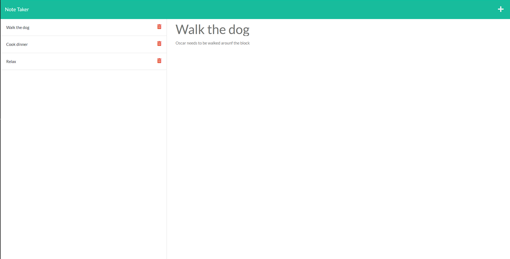

# Note Taker

## Description

Note Taker is an app that a user can use to create, save, view, and delete notes. Because this application runs on an Express.js server, I decided to deploy it using Heroku.

## Website

## Built With

- HTML
- CSS
- Bootstrap
- Javascript
- Node.js
- Express.js
- Heroku

## Screenshot

## Contributions

- Caleb Funderburk